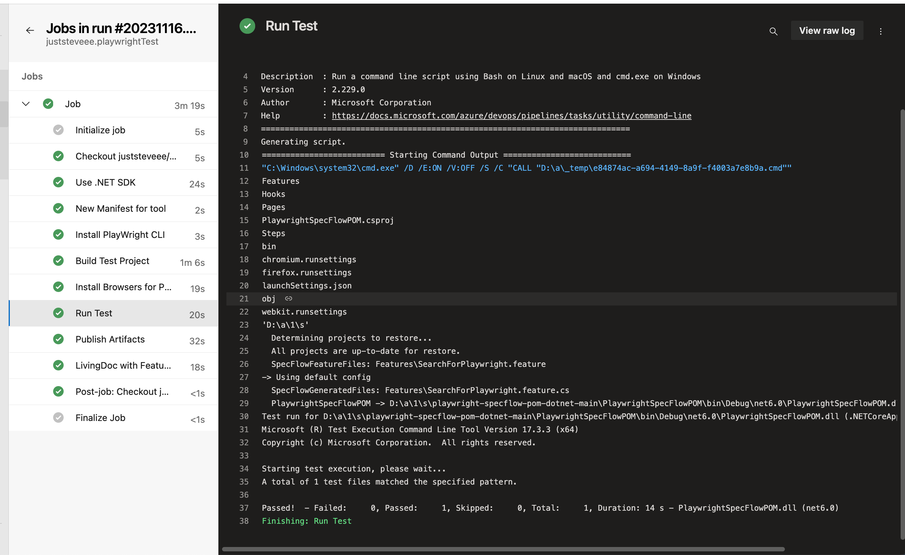
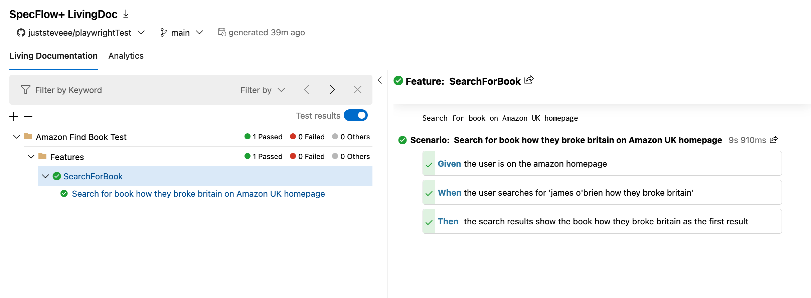
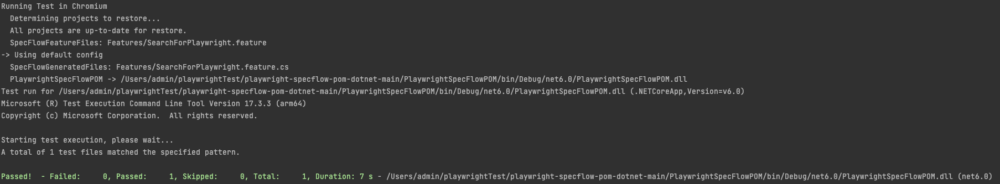
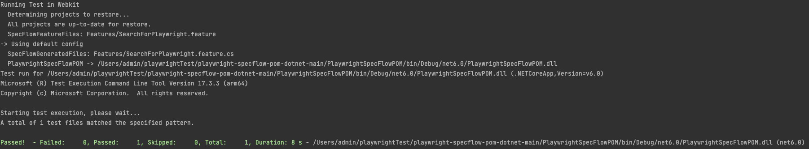
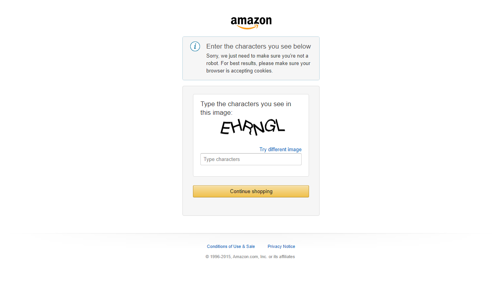

### How To Build and Run Tests
- Git clone repo `https://github.com/juststeveee/Playwright.git`
- Open terminal and 
    - Cd to the downloaded repo`cd Playwright/playwright-specflow-pom-dotnet-main/PlaywrightSpecFlowVerifaro`
    - build project `dotnet build`
    - Install playwright `pwsh bin/Debug/net6.0/playwright.ps1 install`

- To run test in Chrome
    - `dotnet test --settings:chromium.runsettings`

- To run test in FireFox
    - `dotnet test --settings:firefox.runsettings`

- To run test in Webkit
    - `dotnet test --settings:webkit.runsettings`

### Framework Components
My test framework consists of the following libraries;
- Playwright Test Framework
- Nunit Test Runner
- Specflow
- Living Doc
- Fluent Assertions

### Playwright vs Selenium
Based on our initial discussion, it seems that you're currently using Selenium. I thought it might be useful to offer a high-level comparison between Playwright and Selenium, which could help you evaluate if Playwright might be a beneficial choice for your future projects.

- **Browser Support**:
  - Playwright: Native support for Chromium, Firefox, WebKit; seamless multi-browser testing.
  - Selenium: Broader browser support, including older and less common browsers.
- **Language Bindings**:
  - Playwright: Supports JavaScript/TypeScript, Python, C#, Java.
  - Selenium: Wider range, including Java, C#, Python, Ruby, JavaScript.
- **Execution Speed and Reliability**:
  - Playwright: Faster, modern architecture, auto-wait reduces test flakiness.
  - Selenium: Highly reliable but potentially slower, may need explicit waits.
- **API and Developer Experience**:
  - Playwright: Consistent API across browsers, features like network interception.
  - Selenium: Mature API, may require more code for complex tasks.
- **Mobile Emulation**:
  - Playwright: Strong support, especially for Chromium and WebKit.
  - Selenium: Limited, often supplemented with tools like Appium.
- **Community and Ecosystem**:
  - Playwright: Growing community, increasing integrations.
  - Selenium: Established, extensive community and resources.
- **Setup and Configuration**:
  - Playwright: Easier setup, fewer dependencies.
  - Selenium: Requires browser-specific drivers, possibly complex setup.
- **CI/CD Integration**:
  - Playwright: Built for modern CI/CD, with parallel execution, video recording.
  - Selenium: Used in CI/CD, may need additional setup for advanced features.
- **Use Cases**:
  - Playwright: Suited for modern web apps, SPAs, PWAs.
  - Selenium: Broad applicability, including legacy systems.
- **Maintainability**:
  - Playwright: Easier maintenance with consistent API.
  - Selenium: May need more upkeep for complex, dynamic web apps.

- Playwright is emerging as a prominent contender in the web automation landscape, rapidly gaining momentum in the market. Its modern approach, coupled with remarkable 
speed and reliability, sets it apart, drawing the attention of numerous companies. 
- The decision to adopt Playwright often hinges on distinct project needs, 
the existing technological infrastructure, and the skill set of the team. Given its growing prominence, it's advisable to consider Playwright for upcoming projects, 
if it's not already on your radar!

### Hook File
- In Playwright for .NET, a hook file is used to define setup and teardown logic that can be applied to multiple tests. 
- These hooks are essentially methods that are executed at specific stages of the test lifecycle, such as before all tests begin, before each individual test, after each test, and after all tests have completed. 
- This structure helps in managing reusable code and maintaining a clean test structure.

### Page Object Model (POM)
- I used the POM (Page Object Model) for test organisation, as it promotes modularity by encapsulating functionality and elements into separate page objects. 
- This approach is beneficial for code organisation and reusability.
- Additionally, using this model improves readability, which is crucial for the long-term maintainability of tests. 
It is essential for anyone reading tests to quickly understand the test's objective.

### Multiple browsers
- Playwright enables comprehensive cross-browser testing across multiple browsers — Chromium, Firefox, and WebKit — using a single API. 
- To streamline this process, I developed a PowerShell script that facilitates running tests across these different browsers with just one command;
`pwsh RunTestInAllBrowsers.ps1 `

### Pipeline Integration
- I Integrated the test framework with Azure devops pipelines. - Integrating tests into CI/CD pipelines is fundamental for maintaining software quality, accelerating the development process, reducing risks, and ensuring that the final product meets both the developers' and customers' expectations.
- You can find the the pipeline file here; `playwright-specflow-pom-dotnet-main/azure-pipelines.yml`

### Living Doc Integration
- I implemented Living Documentation alongside SpecFlow. This method provides a constantly updated and dynamic overview of the project's specifications and test results. It's typically presented in a human-friendly format, such as Gherkin.
- This technique improves upon standard documentation methods by maintaining close alignment with the codebase. This ensures that the documentation always accurately represents the application's current status.
- Living Documentation is particularly effective for collaboration with business stakeholders, thanks to its user-friendly interface and easy-to-understand test cases.

### High Level Approach
- My approach before creating any tests is to go through the scenarios and understand the journeys. Whilst doing this I was able to observe the DOM, components, behaviour on actions and performance to help with the test design.
- Once I had an understanding of the journeys and test requirements, I begin by creating the components and actions required for the tests.
- This was followed by understanding the inputs, expected and actual test results and devising the data required.
- In the final step, I create the tests using the components and actions along with the test data, and debug until I see the tests pass.
- Following the tests, I refactor and clean up the tests and classes, and also add some enhancements.

### Test Results

### Improvements
#### Extended Build Times
- When executing the tests within the pipeline, I observed that the project build step occasionally extends beyond 4 minutes. 
- Although time constraints prevented a detailed investigation, under normal circumstances, identifying the cause of such delays would be a priority. 
- Extended pipeline durations can accrue significant costs over time
---
#### Parallelisation
- When creating pipelines, I prioritise parallelising test suites at the earliest stage. 
- This approach fosters efficiency and significantly cuts down the total execution time, a benefit that becomes increasingly valuable as the test framework expands and incorporates more tests.
---
#### Improve Script
- While I created a script to run the same test across different browsers, I believe there could be a more advanced approach than using a PowerShell script. 
- Given the opportunity, I would seek out a more effective method of achieving this.
---
#### Captcha Challenges
- I noticed that captcha challenges on the Amazon UK homepage were causing some test failures, which became clear from the screenshots. 
- Although modifying this aspect on the Amazon website is not within my scope, I expect that an application under my team's management would enable adjustments to similar settings before executing tests. 
- It seems likely that implementing this as a configuration change in the Hooks file would be the most effective approach.
  
---
#### Add Docker Image
- Additionally, I would introduce a Docker image file to execute tests within a containerised environment. 
- Utilising Docker for test runs offers several advantages: 
  - It ensures a consistent and isolated environment for each test iteration
  - Guarantees independence from system-specific configurations
  - Enhances the reliability & reproducibility.
  - Predictability of test outcomes across diverse environments. 
  - Docker file facilitates seamless integration with CI/CD deployments.
